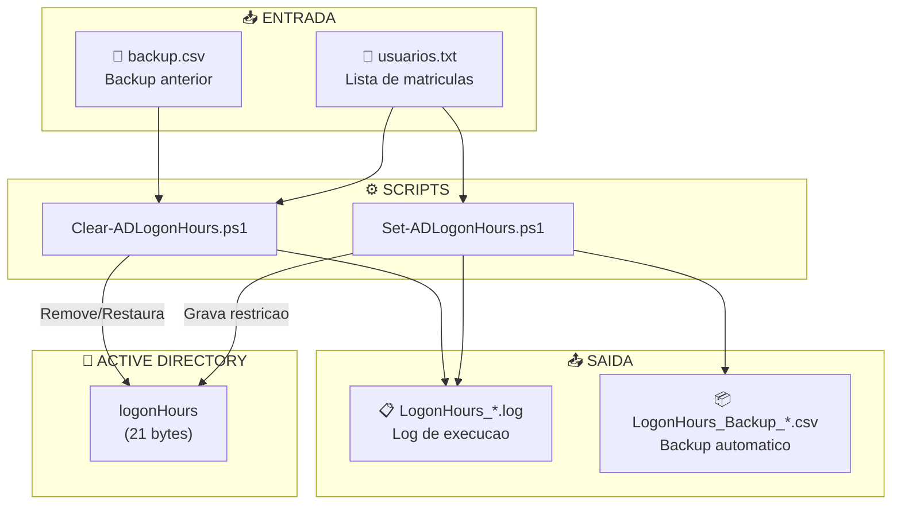
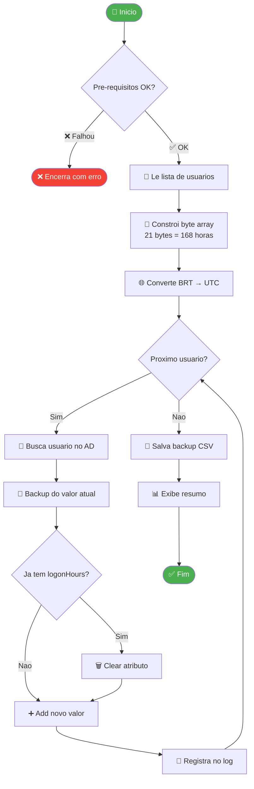
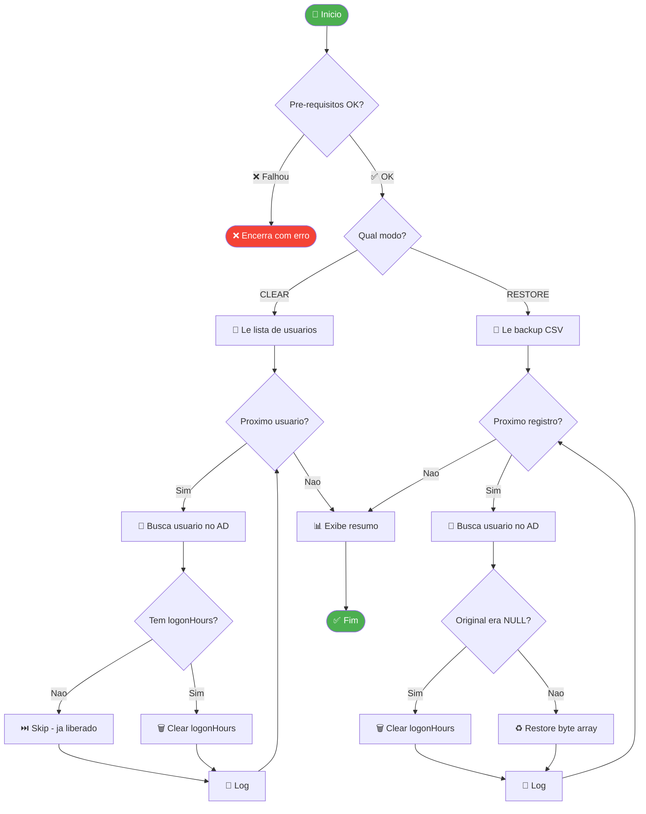
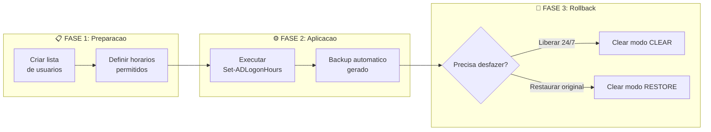
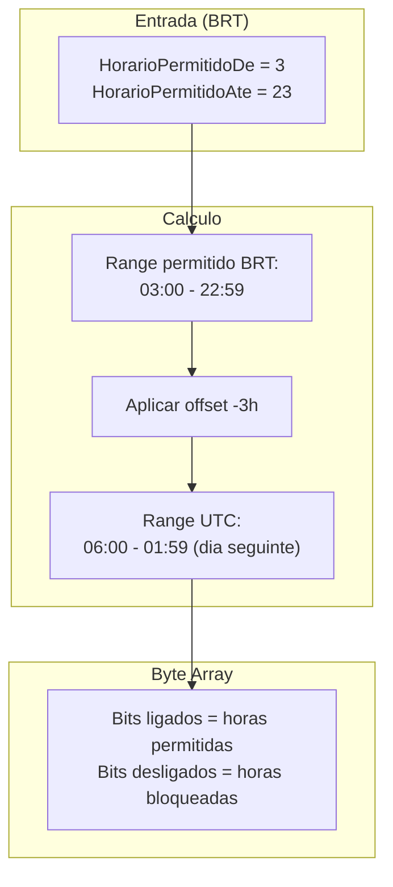
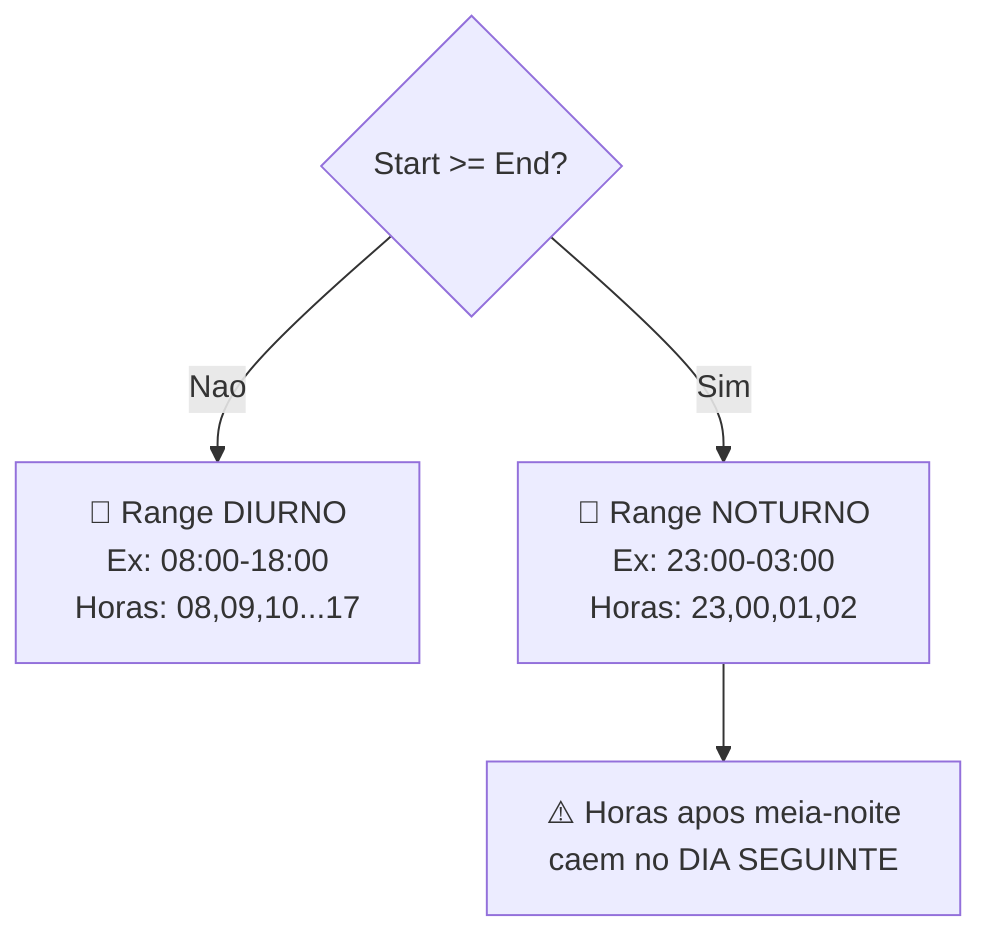

# AD-LogonHours

```
.~~~~~~~~~~~~~~~~~~~~~~~~~~~~~~~~~~~~~~~~~~~~~~~~~~~~~~~~~~~~~~~~~~~~~~~~~~~~~~~~~~~~~~~~~~~~~.
|     _    ____        _                            _   _                                     |
|    / \  |  _ \      | |    ___   __ _  ___  _ __ | | | | ___  _   _ _ __ ___               |
|   / _ \ | | | |_____| |   / _ \ / _` |/ _ \| '_ \| |_| |/ _ \| | | | '__/ __|              |
|  / ___ \| |_| |_____| |__| (_) | (_| | (_) | | | |  _  | (_) | |_| | |  \__ \              |
| /_/   \_\____/      |_____\___/ \__, |\___/|_| |_|_| |_|\___/ \__,_|_|  |___/              |
|                                 |___/                                                      |
.~~~~~~~~~~~~~~~~~~~~~~~~~~~~~~~~~~~~~~~~~~~~~~~~~~~~~~~~~~~~~~~~~~~~~~~~~~~~~~~~~~~~~~~~~~~~~.
|  PowerShell Scripts para Gerenciamento de Horarios de Logon no Active Directory            |
.~~~~~~~~~~~~~~~~~~~~~~~~~~~~~~~~~~~~~~~~~~~~~~~~~~~~~~~~~~~~~~~~~~~~~~~~~~~~~~~~~~~~~~~~~~~~~.
```

[](https://docs.microsoft.com/powershell/)
[](https://docs.microsoft.com/windows-server/identity/ad-ds/)
[](LICENSE)

---

## Indice

- [Sobre o Projeto](#sobre-o-projeto)
- [Como Funciona o logonHours no AD](#como-funciona-o-logonhours-no-ad)
- [Arquitetura da Solucao](#arquitetura-da-solucao)
- [Pre-requisitos](#pre-requisitos)
- [Instalacao](#instalacao)
- [Uso](#uso)
  - [Set-ADLogonHours](#set-adlogonhours)
  - [Clear-ADLogonHours](#clear-adlogonhours)
- [Fluxogramas](#fluxogramas)
- [Exemplos Praticos](#exemplos-praticos)
- [Troubleshooting](#troubleshooting)
- [FAQ](#faq)
- [Changelog](#changelog)
- [Licenca](#licenca)

---

## Sobre o Projeto

Este projeto fornece scripts PowerShell para **controlar os horarios em que usuarios podem fazer logon no dominio Active Directory**.

### Casos de Uso

| Cenario | Solucao |
|---------|---------|
| Bloquear logon fora do horario comercial | `Set-ADLogonHours` com range 08:00-18:00 |
| Bloquear logon noturno (compliance) | `Set-ADLogonHours` com range 03:00-23:00 |
| Remover todas as restricoes | `Clear-ADLogonHours` modo CLEAR |
| Desfazer alteracao indevida | `Clear-ADLogonHours` modo RESTORE |

### Scripts Incluidos

| Script | Funcao |
|--------|--------|
| `Set-ADLogonHours.ps1` | Aplica restricao de horario em lista de usuarios |
| `Clear-ADLogonHours.ps1` | Remove ou restaura restricoes de horario |

---

## Como Funciona o logonHours no AD

### Conceito Basico

O Active Directory armazena restricoes de horario de logon no atributo `logonHours`, que e um **byte array de 21 bytes**.

```
21 bytes = 168 bits = 7 dias x 24 horas
```

Cada bit representa **1 hora** da semana:
- `1` = Usuario pode fazer logon naquela hora
- `0` = Usuario esta bloqueado naquela hora

### Estrutura do Byte Array

| Dia | Bytes | Indices | Horas Cobertas |
|-----|-------|---------|----------------|
| Domingo | 3 | `[0][1][2]` | 00:00 - 23:59 |
| Segunda | 3 | `[3][4][5]` | 00:00 - 23:59 |
| Terca | 3 | `[6][7][8]` | 00:00 - 23:59 |
| Quarta | 3 | `[9][10][11]` | 00:00 - 23:59 |
| Quinta | 3 | `[12][13][14]` | 00:00 - 23:59 |
| Sexta | 3 | `[15][16][17]` | 00:00 - 23:59 |
| Sabado | 3 | `[18][19][20]` | 00:00 - 23:59 |
| **Total** | **21** | `[0-20]` | **168 horas** |

```
Visualizacao Linear:

[0][1][2] [3][4][5] [6][7][8] [9][10][11] [12][13][14] [15][16][17] [18][19][20]
|_______| |_______| |_______| |_________| |__________| |__________| |__________|
   Dom       Seg       Ter        Qua          Qui          Sex          Sab
```

### Mapeamento de Bits

Cada dia tem **3 bytes** (24 horas / 8 bits por byte = 3 bytes):

```
Byte 0 (Domingo 00:00-07:59):
┌───┬───┬───┬───┬───┬───┬───┬───┐
│ 0 │ 1 │ 2 │ 3 │ 4 │ 5 │ 6 │ 7 │  ← Horas (UTC)
└───┴───┴───┴───┴───┴───┴───┴───┘

Byte 1 (Domingo 08:00-15:59):
┌───┬───┬───┬───┬───┬───┬───┬───┐
│ 8 │ 9 │10 │11 │12 │13 │14 │15 │  ← Horas (UTC)
└───┴───┴───┴───┴───┴───┴───┴───┘

Byte 2 (Domingo 16:00-23:59):
┌───┬───┬───┬───┬───┬───┬───┬───┐
│16 │17 │18 │19 │20 │21 │22 │23 │  ← Horas (UTC)
└───┴───┴───┴───┴───┴───┴───┴───┘
```

### Conversao de Fuso Horario

> **IMPORTANTE**: O Active Directory armazena `logonHours` em **UTC**.

O script converte automaticamente o horario local (BRT = UTC-3) para UTC:

```
Exemplo: Bloquear 23:00-03:00 BRT

BRT 23:00 → UTC 02:00 (dia seguinte)
BRT 03:00 → UTC 06:00

Portanto, no AD sera armazenado: bloqueio UTC 02:00-06:00
```

### O Que Acontece Quando o Horario Expira?

| Situacao | Comportamento |
|----------|---------------|
| Novo logon | **BLOQUEADO** - Usuario recebe erro "Account restrictions..." |
| Sessao ativa | **NAO DESCONECTA** automaticamente |
| Forcar logoff | Habilitar GPO "Network Security: Force logoff when logon hours expire" |

---

## Arquitetura da Solucao



---

## Pre-requisitos

### Sistema Operacional

| Requisito | Detalhes |
|-----------|----------|
| Windows | Server 2012 R2+ ou Windows 10/11 |
| PowerShell | 5.1 ou superior |
| Privilegios | Executar como Administrador |

### Modulo Active Directory

O script verifica e oferece instalacao automatica:

```powershell
# Windows Server
Install-WindowsFeature RSAT-AD-PowerShell

# Windows 10/11
Add-WindowsCapability -Online -Name Rsat.ActiveDirectory.DS-LDS.Tools~~~~0.0.1.0
```

### Permissoes no AD

O usuario que executa o script precisa de permissao para **modificar o atributo `logonHours`** dos usuarios-alvo.

Geralmente requer:
- Membership no grupo **Account Operators**, ou
- Delegacao especifica de "Write logonHours"

---

## Instalacao

### 1. Clonar o Repositorio

```powershell
git clone https://github.com/lyonzin/AD-LogonHours.git
cd AD-LogonHours
```

### 2. Estrutura de Arquivos

```
AD-LogonHours/
├── Set-ADLogonHours.ps1      # Script para aplicar restricoes
├── Clear-ADLogonHours.ps1    # Script para remover/restaurar
├── README.md                 # Esta documentacao
├── LICENSE                   # Licenca MIT
└── examples/
    └── usuarios_exemplo.txt  # Exemplo de lista de usuarios
```

### 3. Criar Lista de Usuarios

Crie um arquivo `.txt` com um username por linha:

```
# Comentarios sao ignorados (linhas iniciando com #)
joao.silva
maria.santos
pedro.costa
```

Ou use um `.csv` com coluna `SamAccountName`:

```csv
SamAccountName,DisplayName
joao.silva,Joao da Silva
maria.santos,Maria Santos
```

---

## Uso

### Set-ADLogonHours

#### Parametros Configuriaveis

Edite o inicio do script para ajustar:

```powershell
$UserList            = "C:\Scripts\usuarios.txt"   # Lista de usuarios
$HorarioPermitidoDe  = 3                           # Pode logar A PARTIR de (BRT)
$HorarioPermitidoAte = 23                          # NAO pode mais A PARTIR de (BRT)
$DiasAplicados       = @('Sunday','Monday','Tuesday','Wednesday','Thursday','Friday','Saturday')
$UTCOffset           = -3                          # BRT = UTC-3
```

#### Executar

```powershell
# Modo normal
.\Set-ADLogonHours.ps1

# Modo WhatIf (simula sem aplicar)
.\Set-ADLogonHours.ps1 -WhatIf
```

#### Fluxograma de Execucao



---

### Clear-ADLogonHours

#### Modos de Operacao

| Modo | Descricao | Arquivo Necessario |
|------|-----------|-------------------|
| `CLEAR` | Remove restricao (libera 24/7) | Lista de usuarios (.txt/.csv) |
| `RESTORE` | Restaura valor original do backup | Backup CSV gerado pelo Set |

#### Parametros Configuriaveis

```powershell
$Modo              = "CLEAR"                      # "CLEAR" ou "RESTORE"
$ArquivoUsuarios   = "C:\Scripts\usuarios.txt"   # Usado no modo CLEAR
$ArquivoBackup     = ""                          # Usado no modo RESTORE
```

#### Executar

```powershell
# Modo CLEAR - Remove todas as restricoes
.\Clear-ADLogonHours.ps1

# Modo RESTORE - Restaura valores originais
# (edite $Modo = "RESTORE" e $ArquivoBackup = "caminho\backup.csv")
.\Clear-ADLogonHours.ps1
```

#### Fluxograma de Execucao



---

## Fluxogramas

### Fluxo Completo da Solucao



### Conversao de Horario BRT → UTC



### Deteccao de Range Noturno



---

## Exemplos Praticos

### Exemplo 1: Bloquear Logon Noturno (23:00-03:00)

```powershell
# Configuracao no Set-ADLogonHours.ps1
$HorarioPermitidoDe  = 3    # Pode logar a partir das 03:00
$HorarioPermitidoAte = 23   # Bloqueado a partir das 23:00

# Resultado: Usuario pode logar entre 03:00 e 22:59
```

### Exemplo 2: Horario Comercial (08:00-18:00)

```powershell
$HorarioPermitidoDe  = 8    # Pode logar a partir das 08:00
$HorarioPermitidoAte = 18   # Bloqueado a partir das 18:00

# Resultado: Usuario pode logar entre 08:00 e 17:59
```

### Exemplo 3: Segunda a Sexta Apenas

```powershell
$DiasAplicados = @('Monday','Tuesday','Wednesday','Thursday','Friday')

# Resultado: Sabado e Domingo completamente bloqueados
```

### Exemplo 4: Restaurar Apos Erro

```powershell
# 1. O Set-ADLogonHours.ps1 gerou: LogonHours_Backup_20260127_143022.csv

# 2. Edite Clear-ADLogonHours.ps1:
$Modo = "RESTORE"
$ArquivoBackup = ".\LogonHours_Backup_20260127_143022.csv"

# 3. Execute:
.\Clear-ADLogonHours.ps1
```

---

## Troubleshooting

### Erro: "Usuario nao encontrado no AD"

| Causa | Solucao |
|-------|---------|
| Username incorreto | Verifique o SamAccountName correto no AD |
| Usuario em outro dominio | Use o formato `DOMINIO\usuario` ou FQDN |
| Typo no arquivo | Verifique espacos extras ou caracteres invisíveis |

### Erro: "Nao foi possivel contactar Domain Controller"

```powershell
# Verificar conectividade
Test-ComputerSecureChannel -Verbose

# Verificar DNS
nslookup _ldap._tcp.dc._msdcs.seudominio.com

# Verificar se esta no dominio
(Get-WmiObject Win32_ComputerSystem).Domain
```

### Erro: "Access Denied" ou "Insufficient Permissions"

O usuario executando precisa de:
1. Permissao de escrita no atributo `logonHours`
2. Geralmente: membership em **Account Operators** ou **Domain Admins**

### Restricao Nao Funcionando

| Sintoma | Causa | Solucao |
|---------|-------|---------|
| Usuario continua logando | Sessao ja estava ativa | Forcar logoff via GPO |
| Horario errado | Fuso horario incorreto | Verificar $UTCOffset no script |
| Funcionou parcialmente | Range noturno mal configurado | Verificar se Start > End |

### Verificar logonHours de um Usuario

```powershell
# Ver valor raw
Get-ADUser -Identity "joao.silva" -Properties logonHours | Select logonHours

# Ver de forma legivel
$user = Get-ADUser -Identity "joao.silva" -Properties logonHours
[System.BitConverter]::ToString($user.logonHours)
```

---

## FAQ

### O bloqueio desconecta usuarios ja logados?

**Nao.** O atributo `logonHours` apenas impede **novos logons**. Para desconectar automaticamente quando o horario expira, habilite a GPO:

```
Computer Configuration → Policies → Windows Settings → Security Settings → Local Policies → Security Options
→ "Network Security: Force logoff when logon hours expire" = Enabled
```

### Posso definir restricao por minuto?

**Nao.** O AD trabalha com granularidade de **1 hora**. Se precisar de controle mais fino, considere:
- GPOs com scripts de logon/logoff
- Solucoes de terceiros (PAM, Identity Manager)

### Funciona com Azure AD?

**Nao diretamente.** Este script e para **Active Directory on-premises**. Para Azure AD/Entra ID, use:
- Conditional Access Policies
- Azure AD Identity Governance

### Posso aplicar em OUs inteiras?

Atualmente o script trabalha com **lista de usuarios**. Para aplicar em OUs, faca:

```powershell
# Exportar usuarios de uma OU para arquivo
Get-ADUser -SearchBase "OU=Vendas,DC=empresa,DC=com" -Filter * |
    Select-Object -ExpandProperty SamAccountName |
    Out-File -FilePath "usuarios_vendas.txt"
```

### O backup e seguro?

O backup CSV armazena o `logonHours` original em **Base64**. Nao contem senhas ou dados sensiveis - apenas o byte array de restricao de horario.

---

## Changelog

### v1.0.0 (2026-01-27)

- Release inicial
- `Set-ADLogonHours.ps1`: Aplicacao de restricoes
- `Clear-ADLogonHours.ps1`: Remocao/restauracao de restricoes
- Backup automatico em CSV
- Suporte a range noturno (cruza meia-noite)
- Conversao automatica BRT → UTC
- Verificacao de pre-requisitos com instalacao automatica do modulo AD

---

## Licenca

Este projeto esta licenciado sob a [MIT License](LICENSE).

---

## Autor

**Ailton Rocha** (Lyon.)
- GitHub: [@lyonzin](https://github.com/lyonzin)

---
